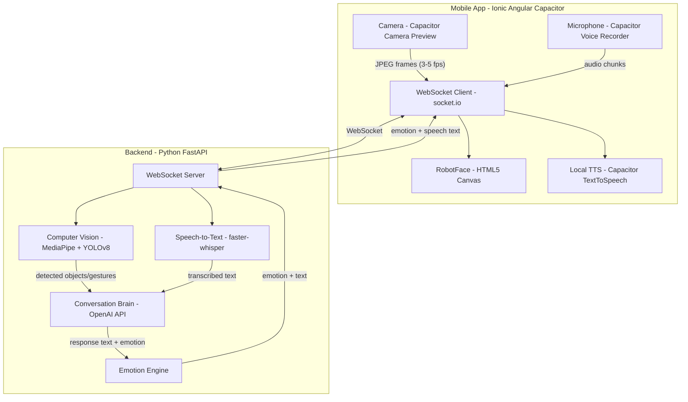
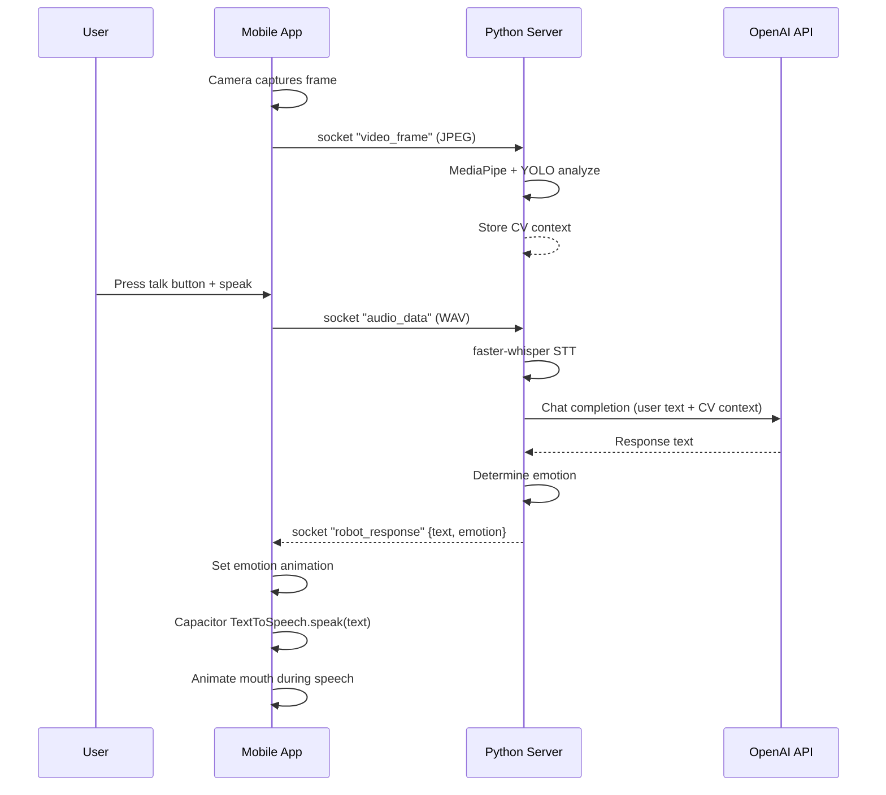

# RoboPet -- план реализации

## Выбор технологий

### Frontend: Ionic 8 + Angular 19 + Capacitor 6

- **Почему:** Angular по запросу пользователя; Ionic обеспечивает кросс-платформенные UI-компоненты; Capacitor дает доступ к нативным API (камера, микрофон, TTS) на Android и iOS из одной кодовой базы
- **Альтернативы отклонены:** Kivy/BeeWare (слабая экосистема, плохой UX), Flutter (Dart, не JS/Python), NativeScript (меньше экосистема чем Ionic)

### Backend: Python FastAPI + WebSocket

- **Почему:** Python, асинхронность, простая интеграция с ML-библиотеками, OpenAI SDK
- **Запуск:** на локальном компьютере в одной WiFi-сети с телефоном

---

## Архитектура



---

## Ключевые библиотеки

### Frontend (TypeScript / Angular)

- `@ionic/angular` -- UI-фреймворк с мобильными компонентами (кнопки, модалки, layout)
- `@angular/animations` -- плавные анимации лица робота (transitions, keyframes)
- `@capacitor/core` + `@capacitor/cli` -- мост к нативным API Android/iOS
- `@capacitor/camera` -- доступ к камере устройства
- `@capacitor-community/camera-preview` -- живое превью камеры с захватом кадров
- `@capacitor/text-to-speech` -- локальный TTS (нативные движки Android/iOS)
- `@capacitor-community/voice-recorder` -- запись голоса с микрофона
- `socket.io-client` -- WebSocket-связь с бэкендом
- `@capacitor/preferences` -- локальное хранение настроек (IP сервера и т.д.)

### Backend (Python)

- `fastapi` + `uvicorn` -- HTTP + WebSocket сервер
- `python-socketio` -- Real-time двусторонняя связь
- `mediapipe` -- Распознавание жестов рук (21 точка кисти)
- `ultralytics` (YOLOv8-nano) -- Распознавание объектов (80 классов COCO)
- `faster-whisper` -- Локальный STT (Whisper CTranslate2, модель `base`)
- `openai` -- Клиент для OpenAI-совместимого API
- `opencv-python-headless` -- Обработка кадров с камеры
- `numpy` -- Работа с массивами изображений
- `pydantic` -- Валидация данных

---

## Структура проекта

```
robopet/
├── mobile/                              # Ionic + Angular + Capacitor
│   ├── src/
│   │   ├── app/
│   │   │   ├── app.component.ts         # Root component
│   │   │   ├── app.routes.ts            # Angular Router config
│   │   │   ├── pages/
│   │   │   │   ├── home/                # Main screen: лицо робота + камера
│   │   │   │   │   ├── home.page.ts
│   │   │   │   │   ├── home.page.html
│   │   │   │   │   └── home.page.scss
│   │   │   │   └── settings/            # Настройки: IP сервера, голос TTS
│   │   │   │       ├── settings.page.ts
│   │   │   │       ├── settings.page.html
│   │   │   │       └── settings.page.scss
│   │   │   ├── components/
│   │   │   │   ├── robot-face/          # Canvas-лицо робота
│   │   │   │   │   ├── robot-face.component.ts
│   │   │   │   │   ├── robot-face.component.html
│   │   │   │   │   └── robot-face.component.scss
│   │   │   │   ├── camera-view/         # Превью камеры + захват кадров
│   │   │   │   │   ├── camera-view.component.ts
│   │   │   │   │   └── camera-view.component.html
│   │   │   │   └── voice-button/        # Push-to-talk кнопка
│   │   │   │       ├── voice-button.component.ts
│   │   │   │       └── voice-button.component.html
│   │   │   ├── services/
│   │   │   │   ├── socket.service.ts    # Socket.IO singleton
│   │   │   │   ├── camera.service.ts    # Capacitor Camera wrapper
│   │   │   │   ├── voice.service.ts     # Запись + TTS
│   │   │   │   └── emotion.service.ts   # Управление эмоциями робота
│   │   │   └── models/
│   │   │       └── types.ts             # Shared interfaces
│   │   ├── assets/
│   │   ├── global.scss
│   │   ├── index.html
│   │   └── main.ts
│   ├── capacitor.config.ts              # Capacitor config (appId, server URL)
│   ├── ionic.config.json
│   ├── angular.json
│   ├── package.json
│   └── tsconfig.json
│
├── backend/                             # Python FastAPI
│   ├── app/
│   │   ├── __init__.py
│   │   ├── main.py                      # FastAPI app, Socket.IO mount
│   │   ├── config.py                    # Settings (API keys, model paths)
│   │   ├── socket_handlers.py           # WebSocket event handlers
│   │   ├── services/
│   │   │   ├── vision_service.py        # MediaPipe + YOLO wrapper
│   │   │   ├── speech_service.py        # faster-whisper STT
│   │   │   ├── chat_service.py          # OpenAI chat + prompt engineering
│   │   │   └── emotion_service.py       # Определение эмоции по контексту
│   │   └── models/
│   │       └── schemas.py               # Pydantic models
│   ├── requirements.txt
│   ├── .env.example                     # OPENAI_API_KEY, OPENAI_BASE_URL
│   └── Dockerfile                       # Optional containerization
│
├── PLAN.md
├── README.md
└── .gitignore
```

---

## Детальный план по модулям

### 1. Backend: базовый сервер и WebSocket

- Создать FastAPI + Socket.IO сервер в `backend/app/main.py`
- Настроить CORS для мобильного клиента
- Реализовать WebSocket-события: `connect`, `disconnect`, `video_frame`, `audio_chunk`, `chat_message`
- Конфигурация через `.env`: `OPENAI_API_KEY`, `OPENAI_BASE_URL`, `WHISPER_MODEL`

### 2. Backend: компьютерное зрение

- `vision_service.py`: инициализация MediaPipe Hands + YOLOv8n
- MediaPipe: распознавание жестов (open palm, fist, thumbs up, pointing, peace/victory) по 21 landmark точке кисти
- YOLOv8-nano: детекция объектов из COCO dataset (80 классов: чашка, бутылка, книга, телефон, и т.д.)
- Обработка: принимает JPEG-кадр (~640x480), возвращает `{gestures: [...], objects: [...]}`
- Throttling: обрабатывать не чаще 3-5 fps для экономии CPU

### 3. Backend: речь и чат

- `speech_service.py`: загрузка модели `faster-whisper` (base), транскрибация WAV-чанков
- `chat_service.py`: системный промпт "ты дружелюбный робот-питомец", история разговора, отправка контекста CV в сообщения
- `emotion_service.py`: анализ ответа LLM, определение эмоции (happy, sad, surprised, angry, thinking, neutral) по ключевым словам или через отдельный prompt

### 4. Frontend: проект Ionic Angular и навигация

- Инициализация проекта: `ionic start robopet blank --type=angular --capacitor`
- Установка Capacitor-плагинов: `@capacitor-community/camera-preview`, `@capacitor/text-to-speech`, `@capacitor-community/voice-recorder`, `@capacitor/preferences`
- Установка: `socket.io-client`
- Angular Router: два маршрута -- `/home` (основной экран) и `/settings` (настройки)
- Экран настроек (`settings.page`): ввод IP-адреса сервера, выбор голоса TTS, переключение фронт/тыл камеры

### 5. Frontend: анимированное лицо робота

- `robot-face.component.ts`: HTML5 Canvas через `@ViewChild('canvas')`, рисование через Canvas 2D API, `requestAnimationFrame` для плавного цикла
- Глаза: два эллипса с зрачками; анимации -- моргание (каждые 3-5 сек, случайно), расширение/сужение, направление взгляда
- Рот: кривая Безье через `ctx.bezierCurveTo()`, форма меняется в зависимости от эмоции; анимация "говорения" (пульсация при TTS)
- Эмоции задаются интерфейсом `EmotionParams` в `types.ts`: размер глаз, кривизна рта, цвет фона, наклон бровей
- Поддерживаемые эмоции: `happy`, `sad`, `surprised`, `angry`, `thinking`, `neutral`, `excited`
- Переходы между эмоциями анимируются плавной интерполяцией параметров (lerp)

### 6. Frontend: камера и голос

- `camera-view.component.ts`: использует `@capacitor-community/camera-preview` для живого превью (маленькое PiP-окно), `captureImage()` с интервалом 200-300ms, отправка base64 JPEG через socket
- `voice-button.component.ts`: нажал-говоришь (push-to-talk), запись через `@capacitor-community/voice-recorder`, отправка base64 аудио на сервер
- `voice.service.ts`: получение ответа через socket, озвучка через `@capacitor/text-to-speech` (нативные движки), флаг `isSpeaking` для синхронизации анимации рта

### 7. Интеграция и поток данных



---

## Задачи реализации

1. **Backend: базовый сервер** -- FastAPI + Socket.IO, WebSocket-события, конфигурация .env
2. **Backend: компьютерное зрение** -- MediaPipe Hands (жесты) + YOLOv8-nano (объекты)
3. **Backend: речь и чат** -- faster-whisper STT + OpenAI API клиент
4. **Backend: эмоции** -- определение эмоции по ответу LLM
5. **Frontend: инициализация** -- Ionic + Angular + Capacitor проект, зависимости, роутинг
6. **Frontend: лицо робота** -- Eyes, Mouth, RobotFace на HTML5 Canvas + анимации
7. **Frontend: камера** -- превью через Capacitor Camera + захват и отправка кадров
8. **Frontend: голос** -- запись голоса, отправка, прием ответа, локальный TTS
9. **Интеграция** -- полный цикл: камера -> CV -> голос -> LLM -> эмоция -> анимация -> TTS
10. **Полировка** -- обработка ошибок, reconnect, UX, тестирование на устройствах

---

## Запуск проекта

**Backend:**

```bash
cd backend
pip install -r requirements.txt
cp .env.example .env   # вписать OPENAI_API_KEY
uvicorn app.main:app --host 0.0.0.0 --port 8000
```

**Frontend:**

```bash
cd mobile
npm install
ionic serve                              # Разработка в браузере
npx cap add android && npx cap add ios   # Добавить платформы
ionic build && npx cap sync              # Синхронизировать с нативными проектами
npx cap open android                     # Открыть в Android Studio
npx cap open ios                         # Открыть в Xcode
```

**Сборка для устройств:**

- Браузер: `ionic serve` для быстрой разработки UI (без нативных плагинов)
- Android: `ionic build && npx cap sync && npx cap open android` -> Run в Android Studio
- iOS: `ionic build && npx cap sync && npx cap open ios` -> Run в Xcode
- Production APK: `cd android && ./gradlew assembleRelease`
